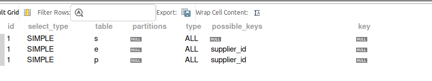
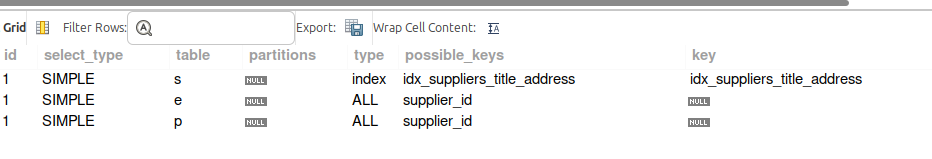
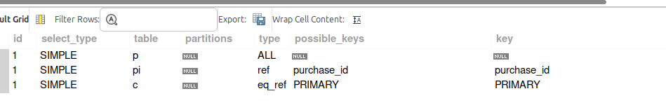
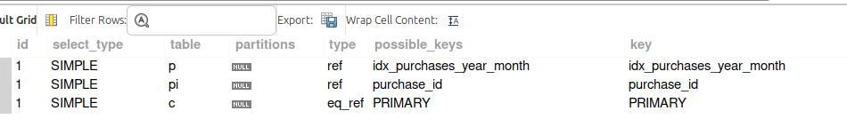

# Индексы

Из прошлых ДЗ собраны запросы, которые составляют основу системы  
[queries.sql]()

Добавлен полнотекстовый индекс и обычные индексы.  
[indexes.sql]()

Ниже анализ двух запросов с индексами и без них

## Список поставщиков (с телефонами, email)
```sql
SELECT 
    s.title,
    s.address->'$.city' AS city,
    s.address->'$.street' AS street,
    s.address->'$.building' AS building,
    GROUP_CONCAT(e.email SEPARATOR ', ') AS emails,
    GROUP_CONCAT(p.phone SEPARATOR ', ') AS phones
FROM suppliers s
LEFT JOIN emails e ON e.supplier_id = s.id 
LEFT JOIN phones p ON p.supplier_id = s.id
GROUP BY s.title, city, street, building
ORDER BY s.title;

CREATE INDEX idx_suppliers_title_address ON suppliers(
    title, 
    (CAST(address->>'$.city' AS CHAR(32)) COLLATE utf8mb4_bin), 
    (CAST(address->>'$.street' AS CHAR(32)) COLLATE utf8mb4_bin), 
    (CAST(address->>'$.building' AS CHAR(32)) COLLATE utf8mb4_bin)
);
```

#### изменение стоимости запроса  
(из explain format=json select ...)

8.90 -> 5.16




## Выборка - покупки текущего месяца
```sql
SELECT 
    p.id,
    CONCAT(c.first_name, ' ', c.last_name) AS full_name,
    DATE_FORMAT(p.purchase_date, '%d.%m.%Y') AS purchase_date,
    SUM(pi.unit_price * pi.quantity) AS total
FROM purchases p 
LEFT JOIN purchase_items pi ON pi.purchase_id = p.id
LEFT JOIN customers c ON c.id = p.customer_id
WHERE YEAR(p.purchase_date) = YEAR(CURDATE()) AND MONTH(p.purchase_date) = MONTH(CURDATE())
GROUP BY p.id, c.first_name, c.last_name, p.purchase_date
ORDER BY p.purchase_date;

CREATE INDEX idx_purchases_year_month ON purchases((YEAR(purchase_date)), (MONTH(purchase_date)));
```

#### изменение стоимости запроса  
(из explain format=json select ...)

5.65 -> 1.80



