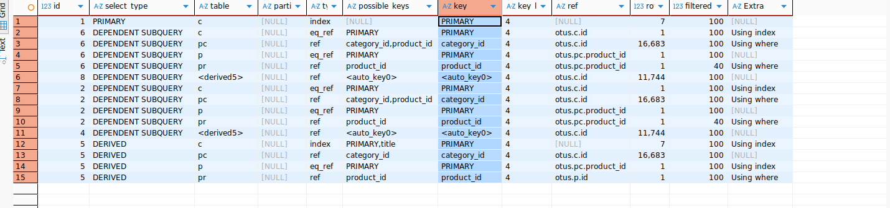
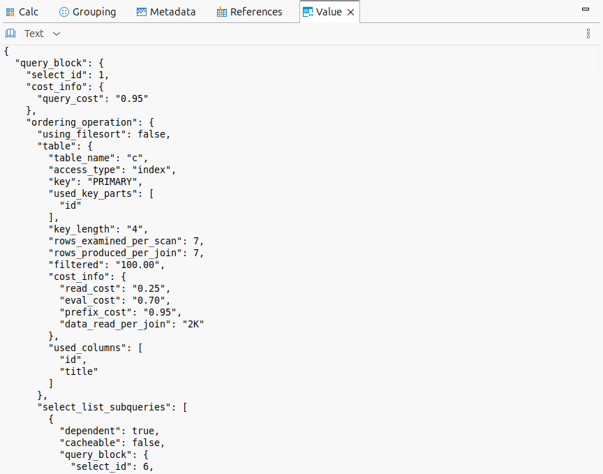
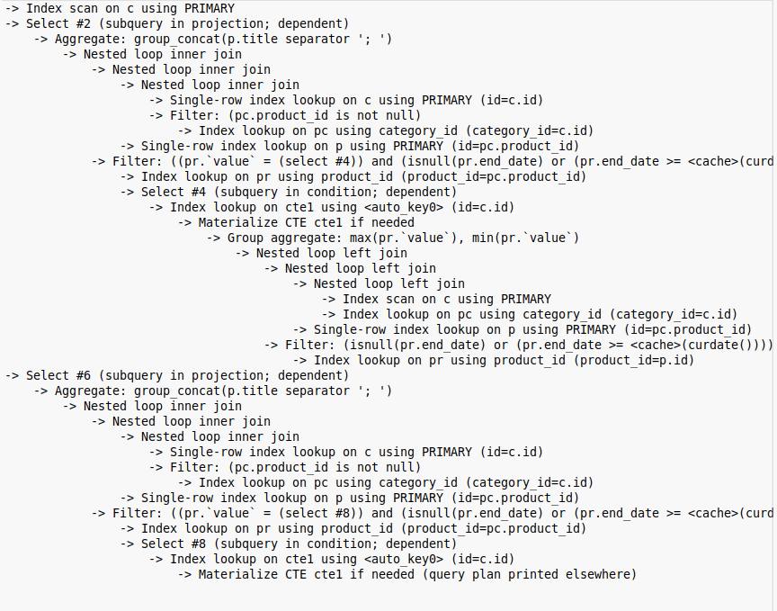
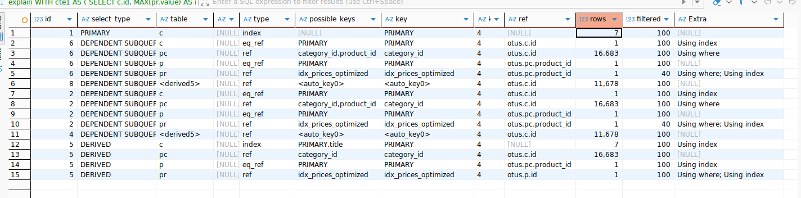

# Анализ и профилирование запроса

[Запрос для анализа](https://github.com/elisad5791/otus-mysql/blob/main/hw17/query.sql)

[Процедура генерации тестовых данных](https://github.com/elisad5791/otus-mysql/blob/main/hw17/procedure.sql)

### План выполнения в трех форматах - обычный, json, tree







### Сложные места

- нельзя построить индексы на cte
- есть filter 40

### Оптимизация

#### Покрывающий индекс

```sql
CREATE INDEX idx_prices_optimized ON prices(product_id, end_date, value);
```
Индекс используется БД, но улучшения производительности незаметно




#### Сбор статистики

```sql
analyze table products;
analyze table product_category;
analyze table prices;
```

немного улучшилось время из explain analyze

```
actual time=0.022..0.027
actual time=0.015..0.017
```


#### Гистограммы

```sql
ANALYZE TABLE prices UPDATE HISTOGRAM ON value; 
ANALYZE TABLE product_category UPDATE HISTOGRAM ON category_id; 
```
Но прироста производительности не дало