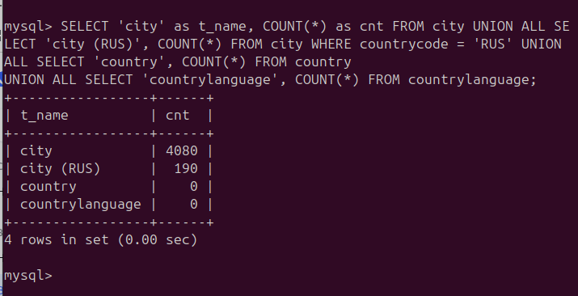

# Восстановить таблицу из бэкапа

Были выполнены следующие действия

1. **Создана директория**  

/tmp/restore_workspace, в ней проводились все работы

2. **Расшифровка и распаковка бекапа**

```bash
openssl aes-256-cbc -d -salt -pbkdf2 -k "password" -in backup.xbs.gz.aes | gzip -d | xbstream -x
```

3. **Подготовка бекапа**

```bash
xtrabackup --prepare --export --target-dir=./
```

4. **Восстановление структуры базы**

```bash
mysql -u root -p
```

```sql
CREATE DATABASE world;
```

```bash
mysql -u root -p world < world.dump.sql
```

5. **Импорт таблицы world.city**

```bash
mysql -u root -p
```

```sql
USE world;
ALTER TABLE city DISCARD TABLESPACE;
```

```bash
sudo cp ./world/city.ibd /var/lib/mysql/world/
sudo cp ./world/city.cfg /var/lib/mysql/world/

sudo chown mysql:mysql /var/lib/mysql/world/city.ibd
sudo chown mysql:mysql /var/lib/mysql/world/city.cfg
```

```bash
mysql -u root -p
```

```sql
USE world;
ALTER TABLE city IMPORT TABLESPACE;
```

6. **Выполнение запроса**

```sql
USE world;

SELECT 'city' as t_name, COUNT(*) as cnt FROM city
UNION ALL
SELECT 'city (RUS)', COUNT(*) FROM city WHERE countrycode = 'RUS'
UNION ALL
SELECT 'country', COUNT(*) FROM country
UNION ALL
SELECT 'countrylanguage', COUNT(*) FROM countrylanguage;
```

7. **Результат**

