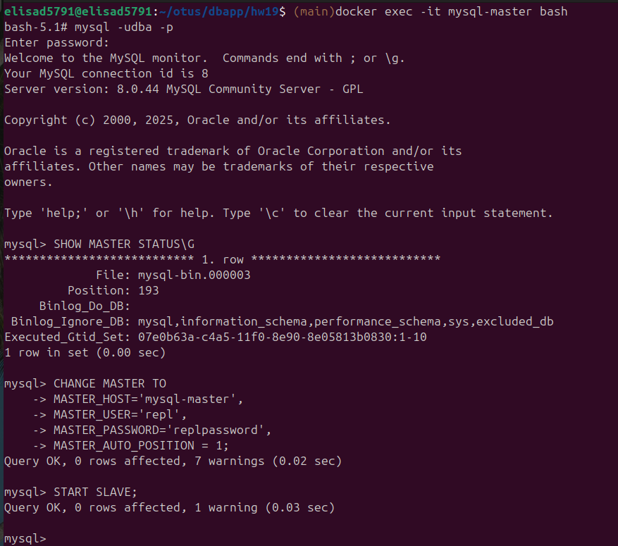
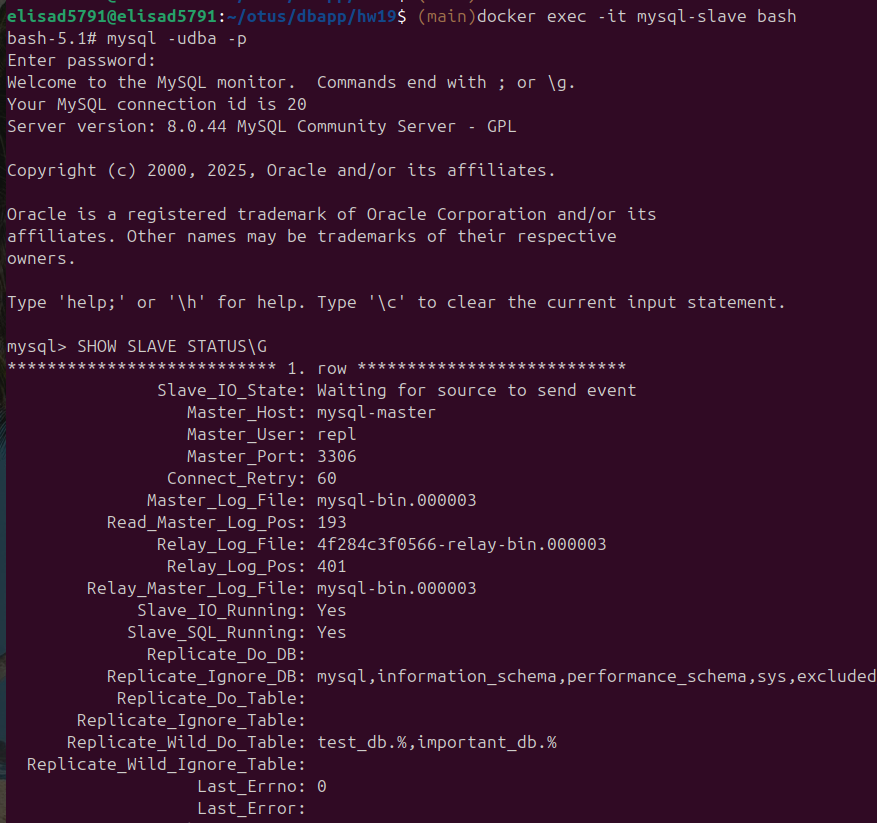
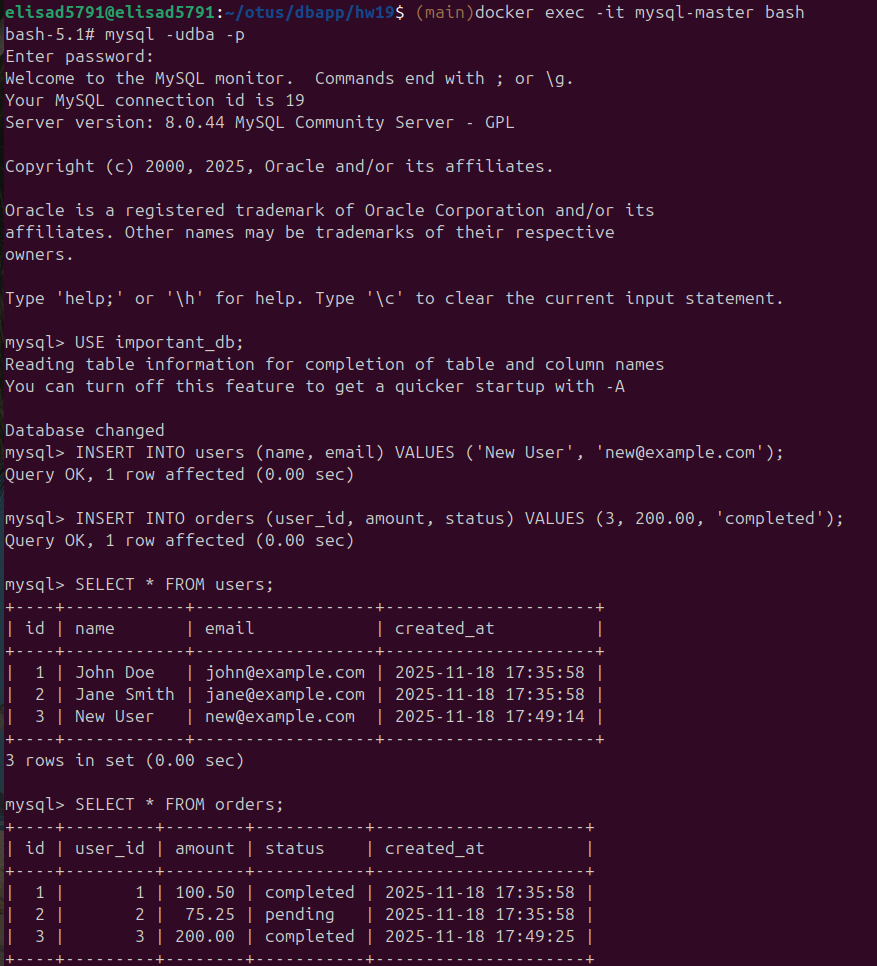
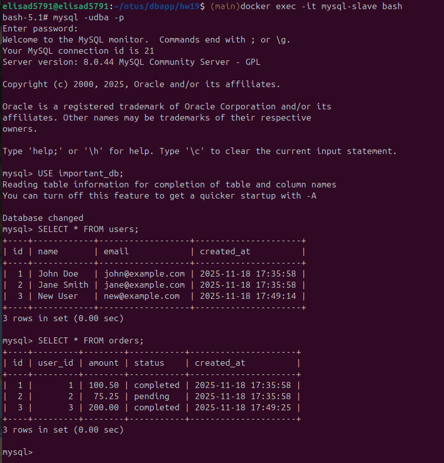
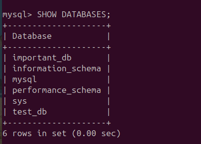
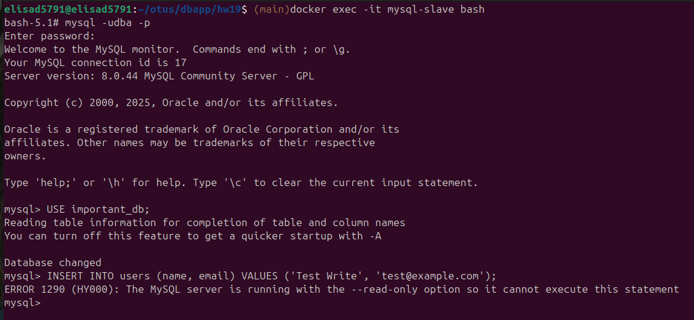

# Настроить репликацию MySQL

1. **Настройка репликации**

2. **Проверка статуса репликации на реплике**

3. **Добавляем данные на мастере**

4. **Проверяем, что они появились на реплике**

5. **Убеждаемся, что исключенная БД excluded_db не реплицировалась**

6. **Проверяем режим read-only**

