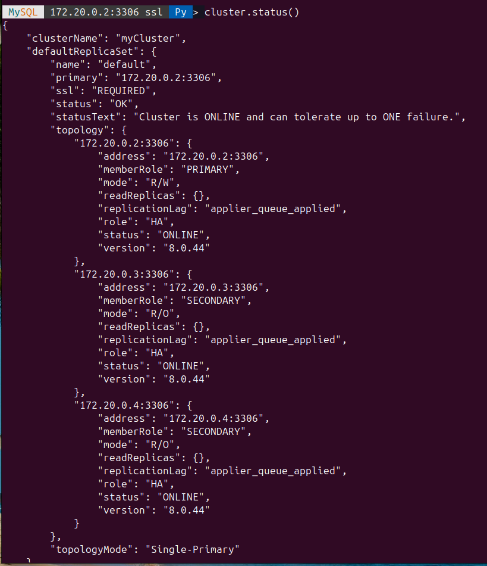
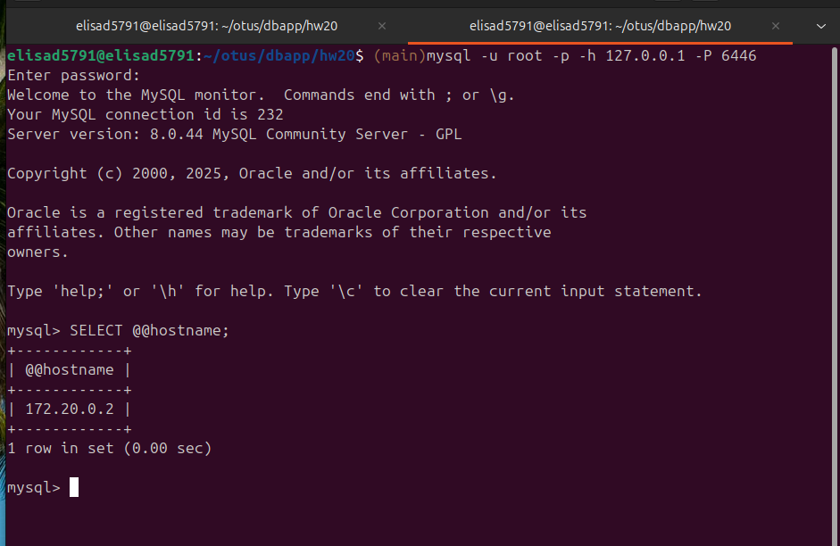
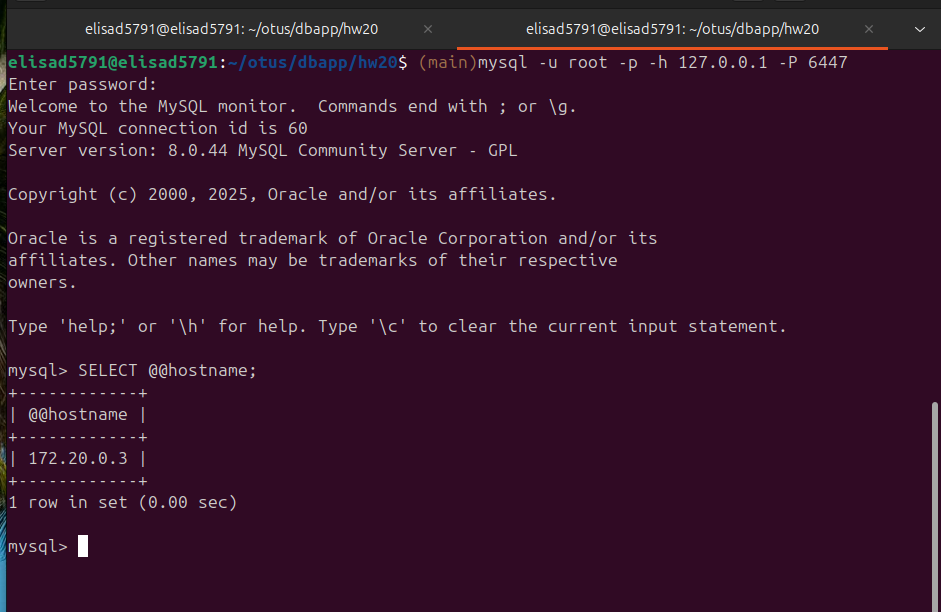
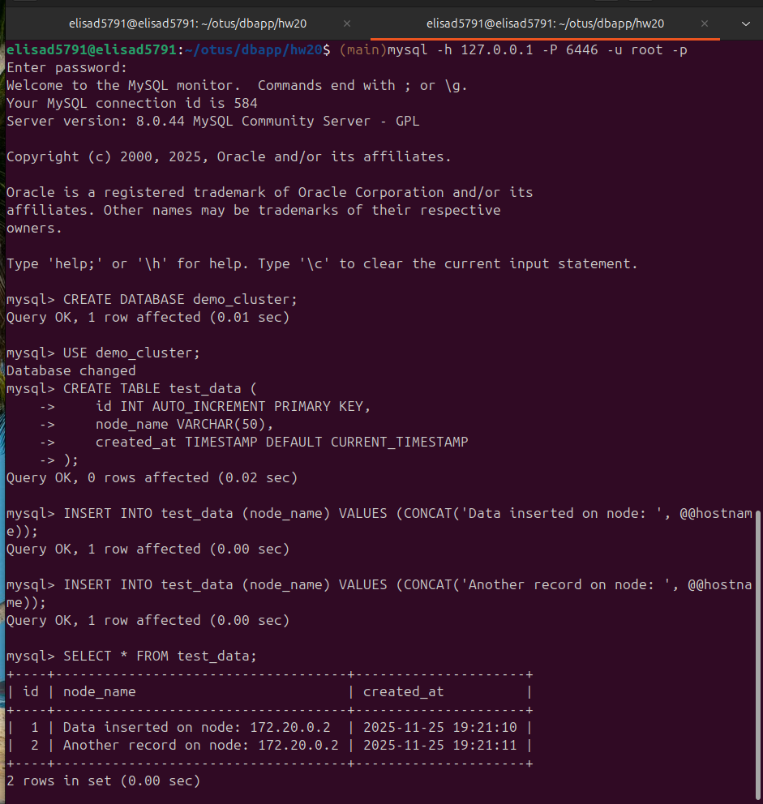
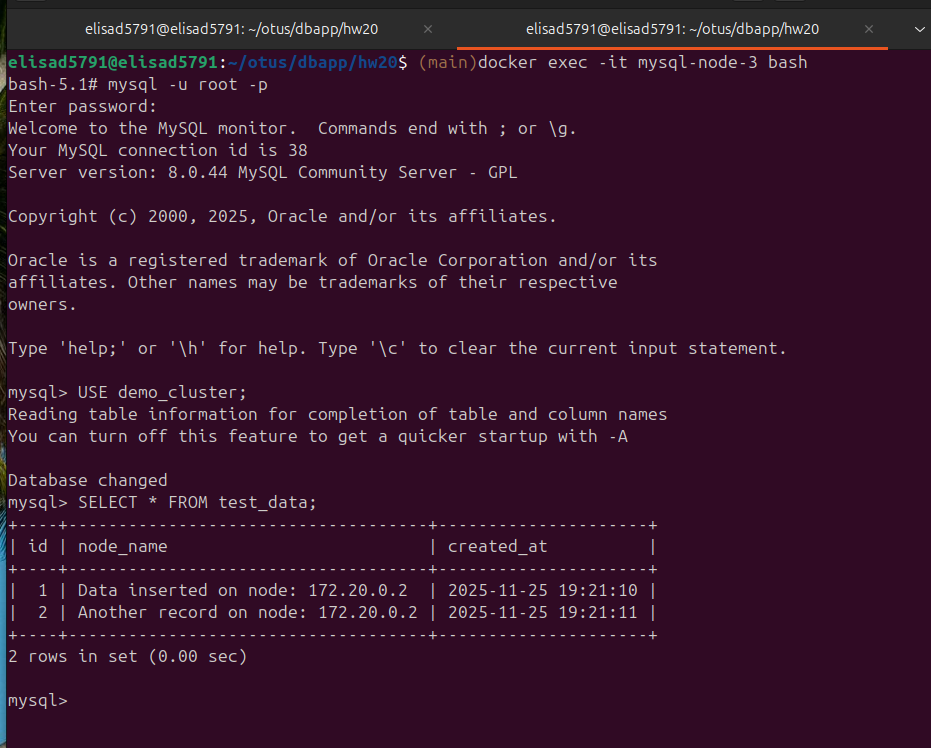
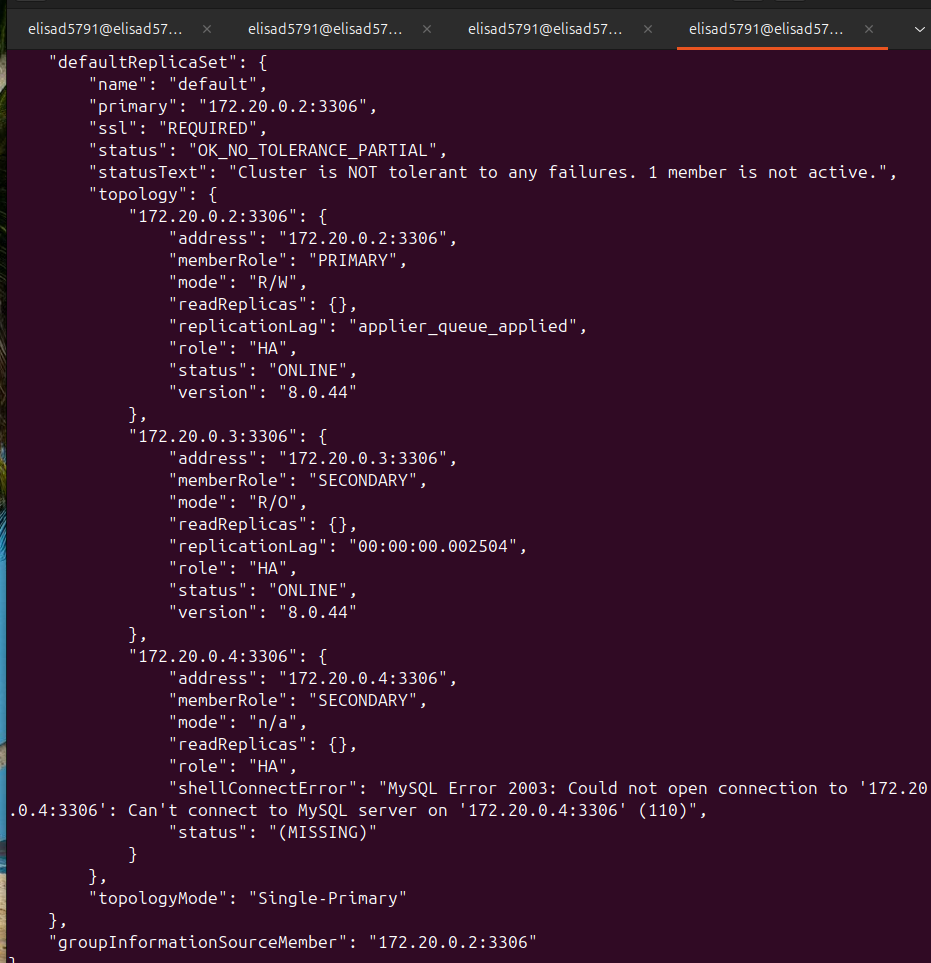
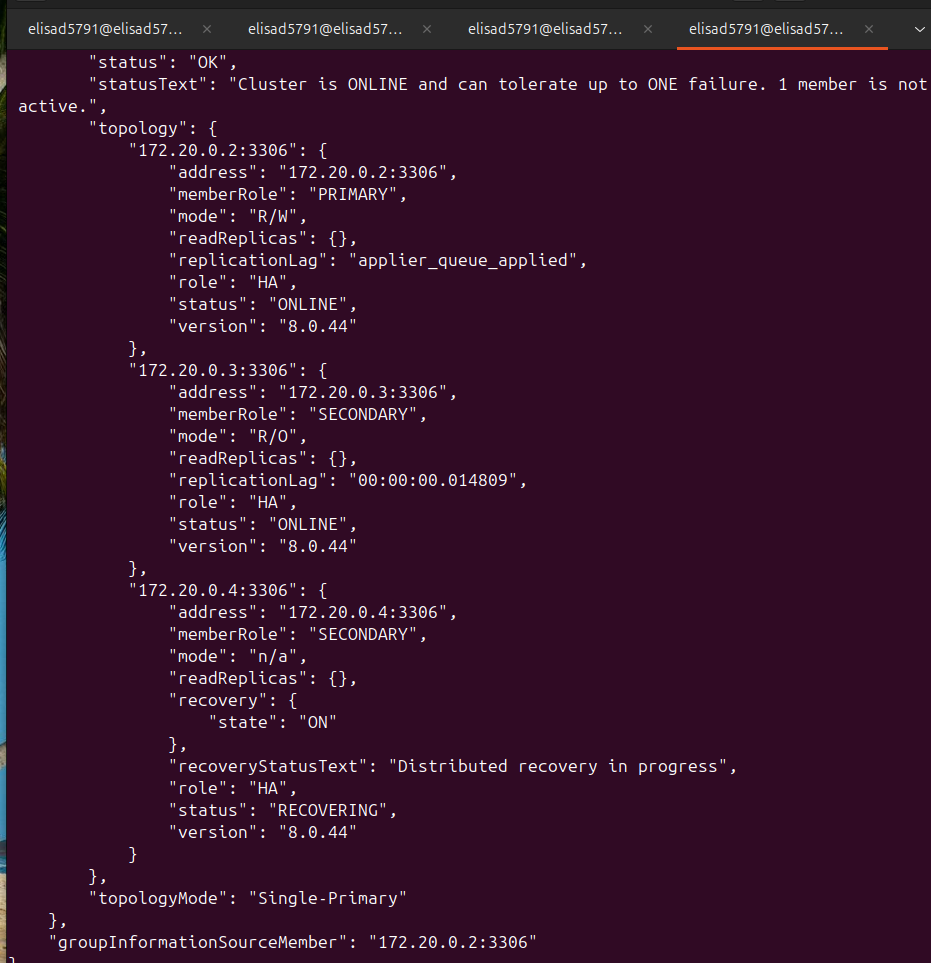
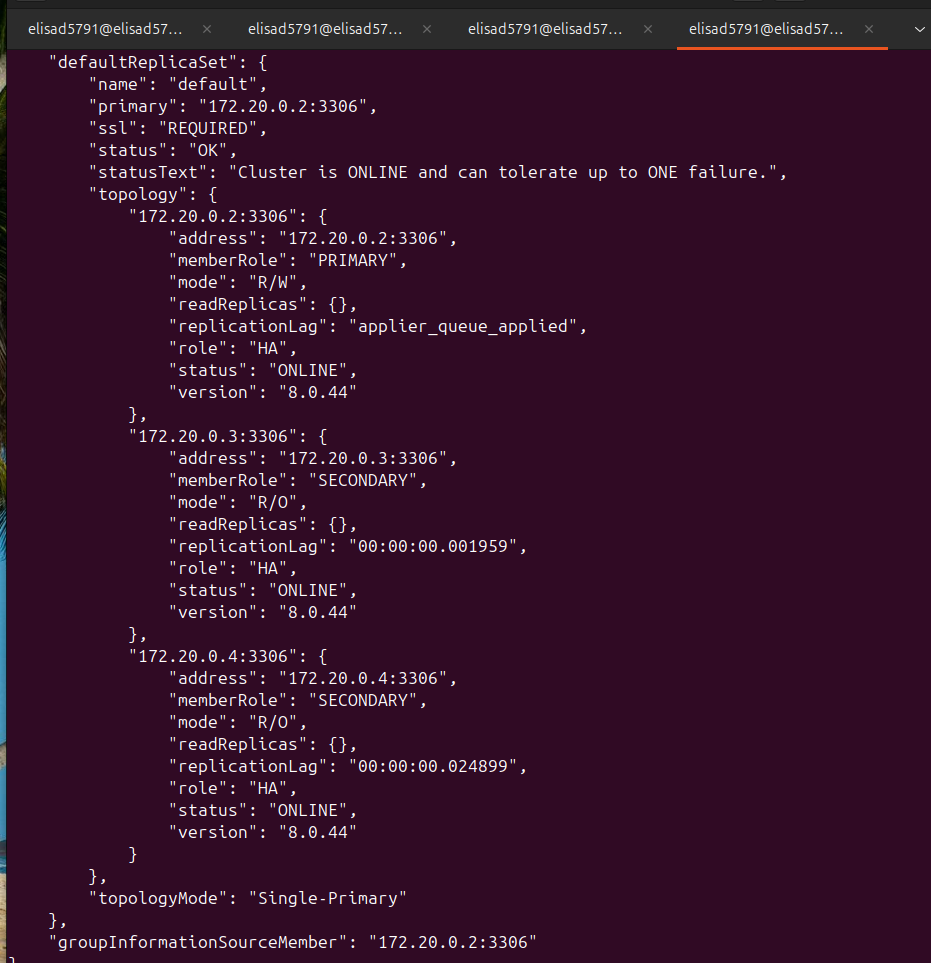
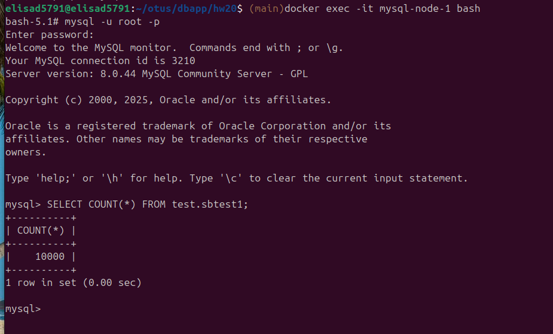
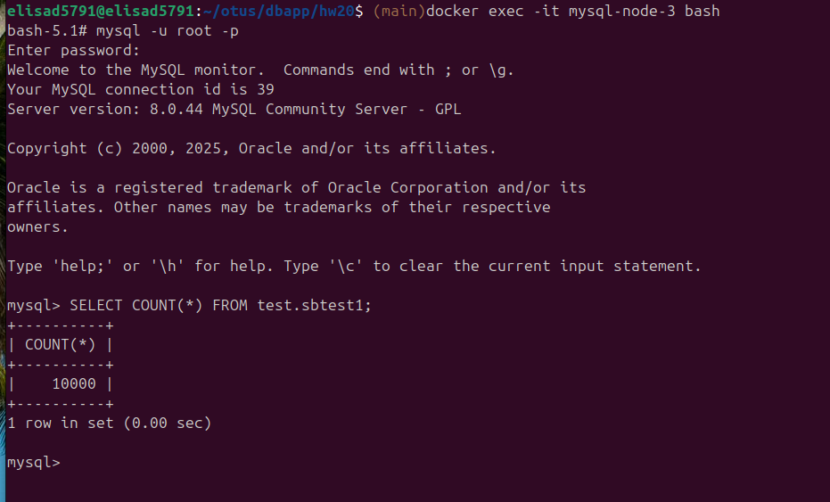

# Развернуть кластер MySQL

### В докере подняты три контейнера с MySQL

### На хост установлен MySQL Shell

```bash
sudo apt-get update
sudo apt-get install mysql-shell
```

### Создан кластер

```bash
mysqlsh
shell.connect('cluster:clusterpassword@172.20.0.2:3306')
dba.configure_instance()
dba.check_instance_configuration()

dba.configure_instance('cluster:clusterpassword@172.20.0.3:3306')
dba.configure_instance('cluster:clusterpassword@172.20.0.4:3306')

cluster = dba.create_cluster('myCluster')

cluster.add_instance('cluster:clusterpassword@172.20.0.3:3306')
cluster.add_instance('cluster:clusterpassword@172.20.0.4:3306')

cluster.status()
```



### На хост установлен MySQL Router

```bash
wget https://dev.mysql.com/get/mysql-apt-config_0.8.28-1_all.deb
sudo dpkg -i mysql-apt-config_0.8.28-1_all.deb
sudo apt-get update
sudo apt-get install -y mysql-router
```

### Запуск роутера

```bash
mkdir -p ~/mysqlrouter
mysqlrouter --force --bootstrap cluster@172.20.0.2:3306 --directory ~/mysqlrouter
mysqlrouter -c /home/elisad5791/mysqlrouter/mysqlrouter.conf
```

### Заходим по порту на запись - первичная нода



### Заходим по порту на чтение - одна из вторичных нод



### Заходим на мастер и пишем данные



### Заходим на вторичные моды и проверяем данные




### Создаем пользователя для тестирования работы при отказе одной ноды

```sql
CREATE DATABASE test;
CREATE USER 'test'@'%' IDENTIFIED BY 'testpassword';
GRANT ALL PRIVILEGES ON test.* TO 'test'@'%';
FLUSH PRIVILEGES;
```

### Создаем тестовую нагрузку

```bash
sysbench oltp_read_write \
    --table-size=10000 \
    --tables=1 \
    --mysql-host=127.0.0.1 \
    --mysql-port=6446 \
    --mysql-user=test \
    --mysql-password=testpassword \
    --mysql-db=test \
    --db-driver=mysql \
    prepare

sysbench oltp_read_write \
    --table-size=10000 \
    --tables=1 \
    --mysql-host=127.0.0.1 \
    --mysql-port=6446 \
    --mysql-user=test \
    --mysql-password=testpassword \
    --mysql-db=test \
    --db-driver=mysql \
    --threads=4 \
    --time=600 \
    --report-interval=5 \
    run
```

### Останавливаем один контейнер

```bash
docker stop mysql-node-3
```

Статус кластера



### Возвращаем контейнер

```bash
docker start mysql-node-3
```

Нода восставливается



Нода вернулась в работу



### Данные на последней ноде согласованы с остальными





