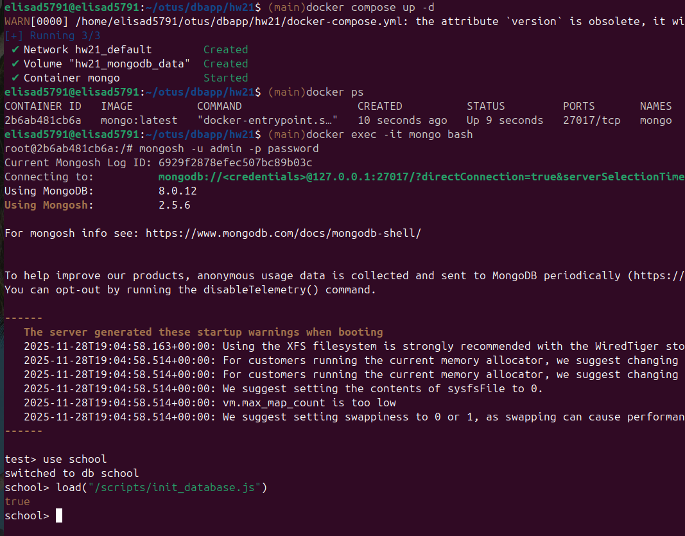
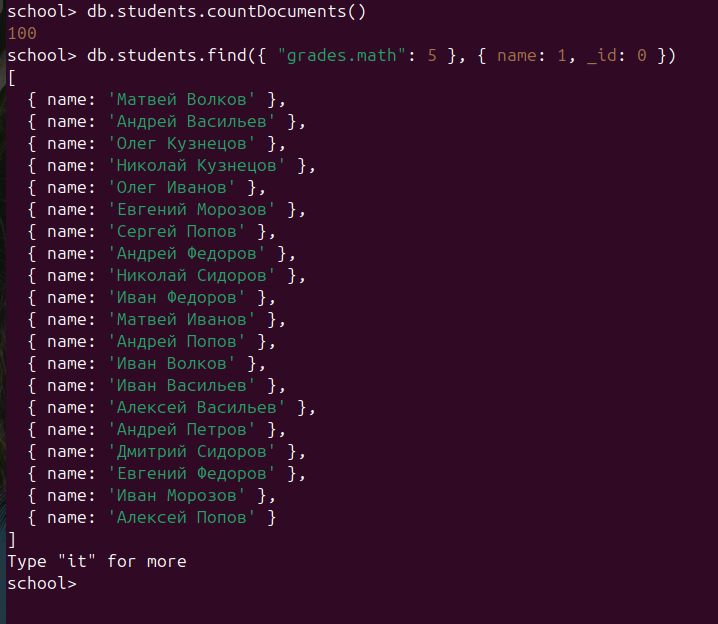
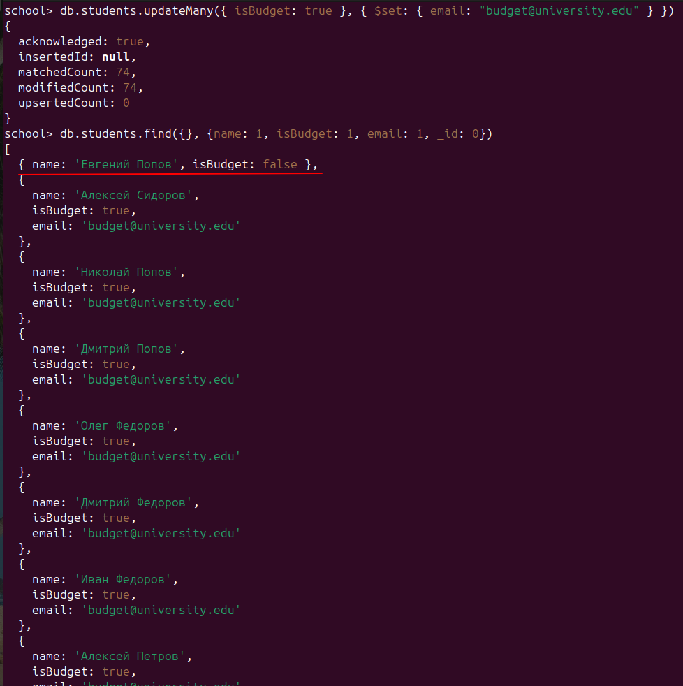
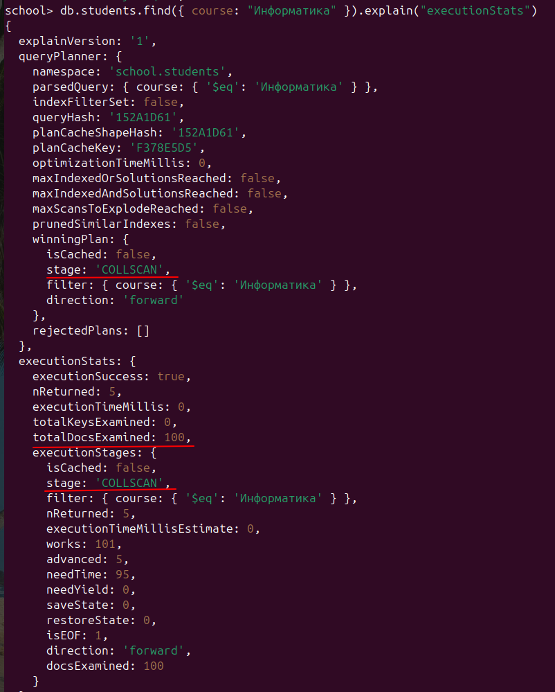
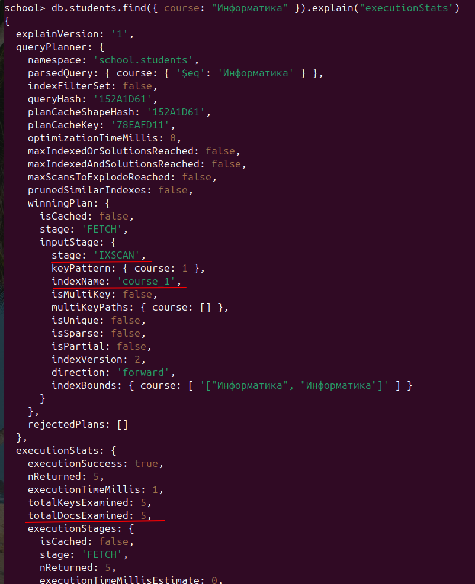

# MongoDB

MongoDB поднят в докере

Заходим в контейнер и запускаем скрипт, который заполняет базу данными.  
Данные о студентах. Пятеро из них занимаются на курсе Информатика, у остальных  
курсы расставлены случайным образом.  

```bash
docker exec -it mongo bash
mongosh -u admin -p password
use school
load("/scripts/init_database.js")
```



Выполняем несколько запросов на выборку и подсчет числа документов

```
db.students.countDocuments()
db.students.find({ "grades.math": 5 }, { name: 1, _id: 0 })
db.students.find({ isBudget: true })
db.students.find({}, { name: 1, age: 1, course: 1, year: 1, _id: 0 })
```



Запросы на обновление

```
db.students.updateMany({}, { $inc: { age: 1 } })
db.students.updateMany({ isBudget: true }, { $set: { email: "budget@university.edu" } })
```



Строим план выполнения запроса на получение всех студентов курса Информатика.  
Полное сканирование коллекции, просмотренных документов - 100

```
db.students.find({ course: "Информатика" }).explain("executionStats")
```



Создаем индекс

```
db.students.createIndex({ course: 1 })
```

Снова смотрим план запроса.  
Использован индекс, просмотренных документов - 5 (вместо 100)

