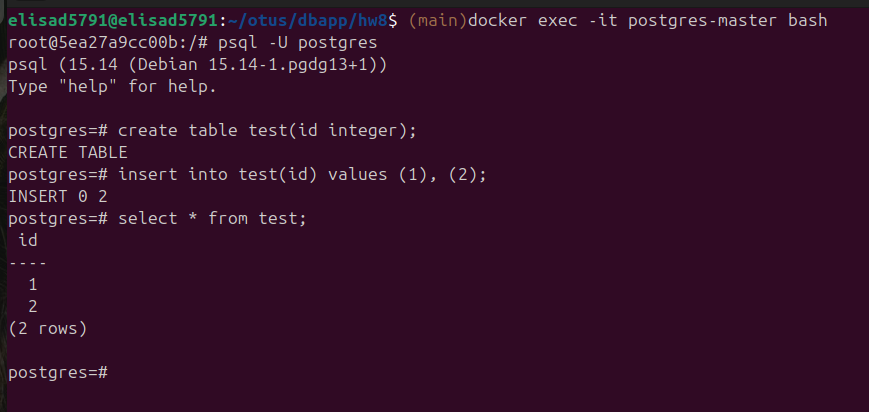
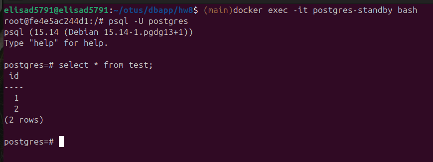
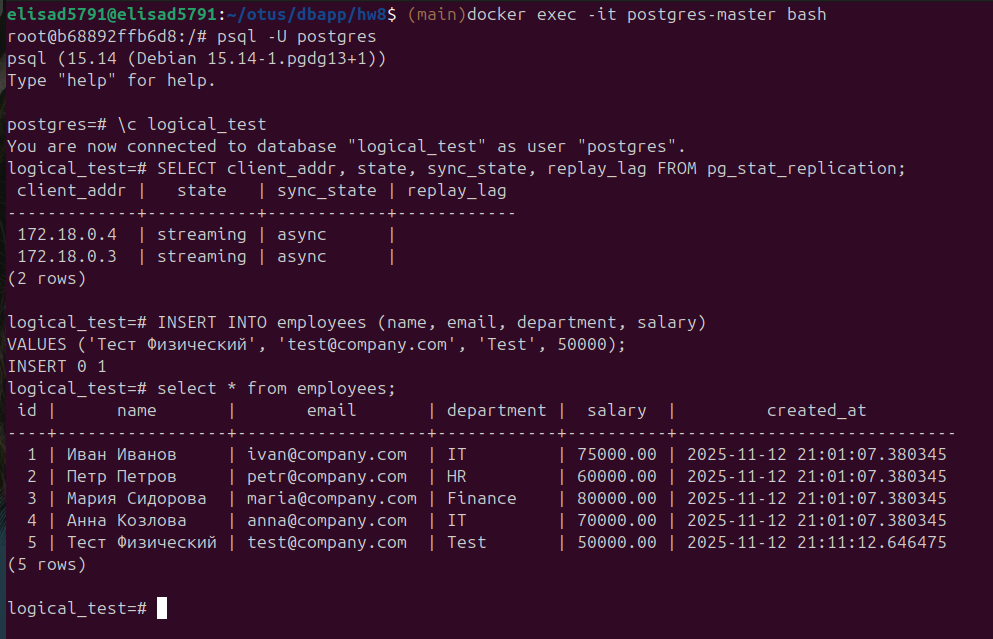
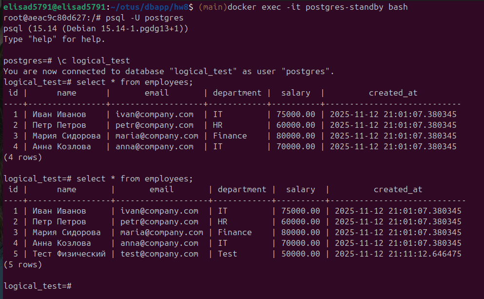
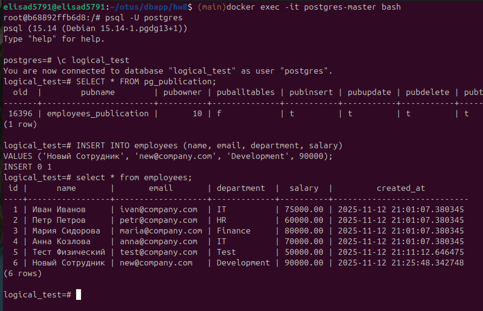
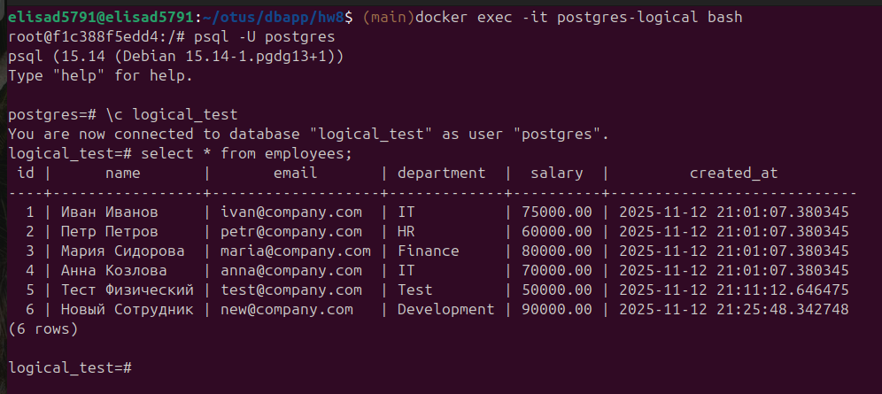

# Делаем физическую и логическую репликации

Сначала было поднято два кластера для настройки физической репликации. 
Видно, что есть одна реплика, репликация работает через физический слот.

На мастере создаем таблицу и добавляем в нее данные.

Через 5 минут данные появляются на реплике.

Затем в систему добавлена логическая реплика. Видно, что реплики уже две.
Добавляем данные на мастере.

Поскольку физическая репликация настроена с отставанием на 5 минут,  
данные на физической реплике появляются не сразу.  
Промежуток между запросами 5 минут.

Убеждаемся, что на мастере создана подписка для логической репликации.  
Добавляем данные.

Данные сразу появляются на логической реплике.

